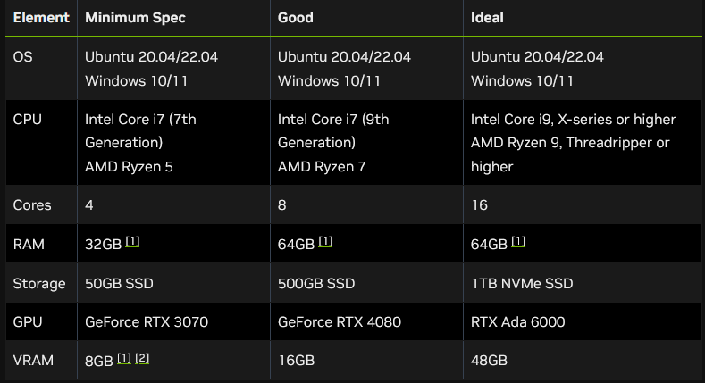
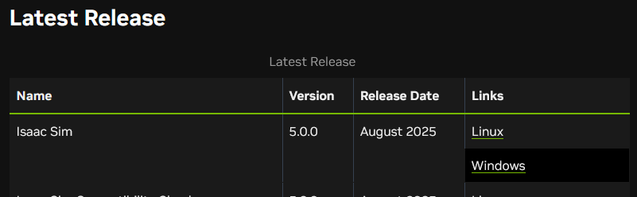
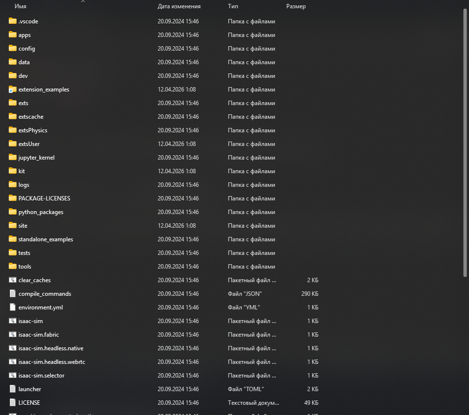
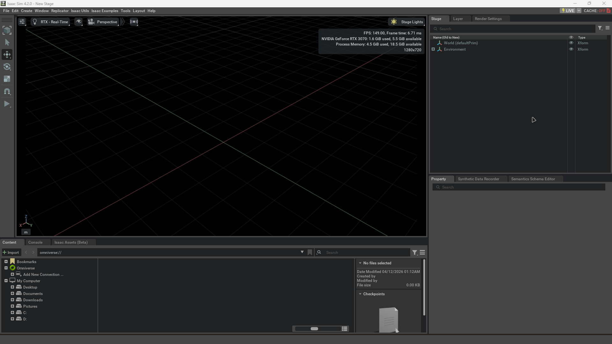
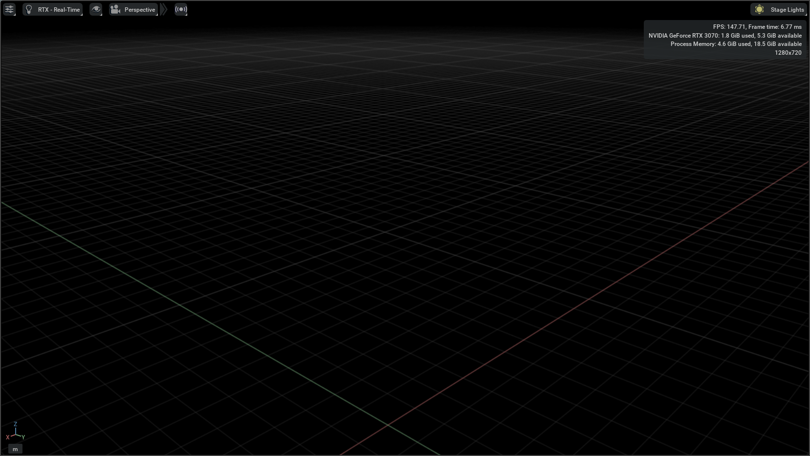
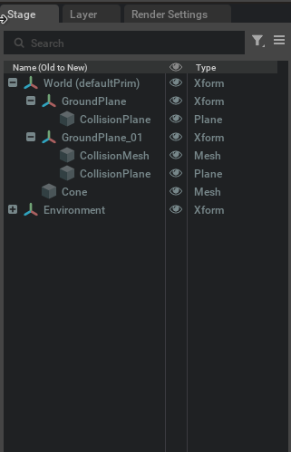
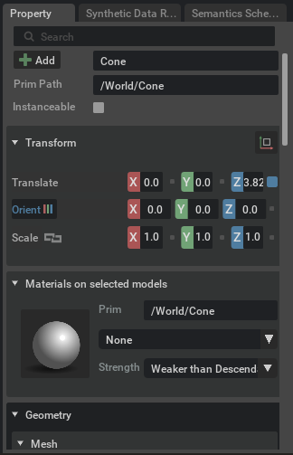
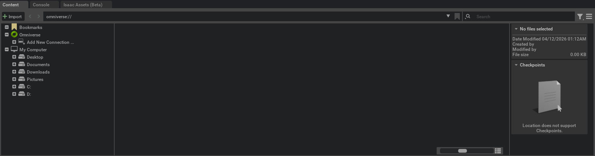
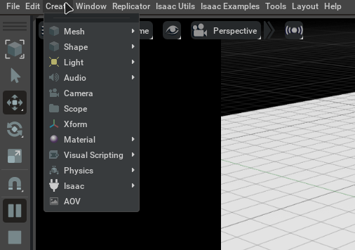
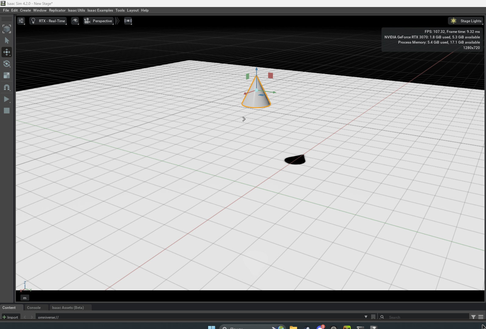

# Урок 1 — Введение в Isaac Sim

---

## Что такое Isaac Sim

Isaac Sim — это симулятор роботов от компании NVIDIA. Программа создаёт виртуальный физический мир, в котором можно размещать роботов, объекты и запускать симуляцию — роботы двигаются, падают, взаимодействуют с предметами так же, как в реальности.

Программа используется инженерами и исследователями, чтобы тестировать роботов до того, как их собирают физически. Это дешевле, быстрее и безопаснее. Такими симуляторами пользуются в компаниях вроде Boston Dynamics, Tesla и NASA.

---

## Системные требования

Перед установкой нужно убедиться, что компьютер подходит. Isaac Sim требует мощного железа.



> **Важно:** нужна видеокарта NVIDIA с поддержкой RTX и не менее 10 ГБ VRAM. Карты AMD, Intel и старые серии NVIDIA GTX не поддерживаются.

---

## Установка Isaac Sim

### Шаг 1 — Скачать

Открыть страницу загрузки:

```
https://docs.isaacsim.omniverse.nvidia.com/5.0.0/installation/download.html
```

В таблице Latest Release найти строку **Isaac Sim** и нажать **Windows**.



### Шаг 2 — Распаковать

Создать папку для Isaac Sim и распаковать туда скачанный архив. После распаковки внутри папки появятся файлы примерно такого вида:



### Шаг 3 — Первый запуск

Дважды кликнуть на `isaac-sim.bat`. Первый запуск занимает 5–15 минут — программа загружает и кэширует шейдеры. Следующие запуски будут намного быстрее (30–60 секунд).


---

## Интерфейс программы

После загрузки откроется главное окно. Оно делится на несколько зон.



Разберём каждую зону отдельно.

---

### 1. Viewport

Большая область по центру с сеткой. Это главная рабочая зона — здесь отображается вся сцена. Именно здесь видны роботы, объекты и результат симуляции.



---

### 2. Stage

Панель в правом верхнем углу. Содержит список всех объектов в сцене — как дерево папок в проводнике. Когда добавляешь робота или объект, он появляется именно здесь.



---

### 3. Property

Панель в правом нижнем углу. Показывает настройки выбранного объекта — его позицию, размер, материал и другие параметры. Пока ничего не выбрано в Stage — панель пустая.



---

### 4. Content

Нижняя панель с вкладками Content / Console / Isaac Assets. Это файловый менеджер — здесь можно найти готовых роботов и объекты и перетащить их прямо в сцену.



---

### 5. Toolbar

Верхняя строка меню: File, Edit, Create, Window, Isaac Utils, Isaac Examples и другие. Через **Create** добавляются объекты и окружение. Через **Isaac Examples** открываются готовые примеры с роботами.



---

## Навигация в сцене

Перемещение по сцене управляется мышью.

| Действие | Управление |
|---|---|
| Повернуть камеру | Правая кнопка мыши + движение |
| Приблизить / отдалить | Колёсико мыши |
| Переместить камеру | Средняя кнопка мыши + движение |

---

## Запуск симуляции

Кнопки управления симуляцией находятся в левой части экрана (вертикальная панель).

**Play** — запускает симуляцию, включается физика  
**Pause** — ставит на паузу  
**Stop** — останавливает и возвращает сцену в исходное состояние  



---

## Практические задания

### Задание 1 — Найди зоны интерфейса

Открой Isaac Sim и найди все 5 зон: Viewport, Stage, Property, Content, Toolbar. Кликни на любой объект в панели Stage и посмотри, что появится в панели Property.

<details>
<summary>Подсказка</summary>

- **Viewport** — большая тёмная область с сеткой по центру
- **Stage** — правый верхний угол, там будет дерево с `World`
- **Property** — правый нижний угол, заполнится после клика на объект в Stage
- **Content** — нижняя панель, вкладки Content / Console / Isaac Assets
- **Toolbar** — строка меню сверху: File, Edit, Create...

</details>

---

### Задание 2 — Первая сцена

В верхнем меню выбери `Create → Shape → Cone` — в сцене появится конус. Осмотри его в Viewport с помощью мыши, кликни на него и посмотри его параметры в Property. Затем нажми Play и понаблюдай, что произойдёт с объектом.

<details>
<summary>Подсказка</summary>

Конус появится в центре сцены. Чтобы его выбрать — кликни прямо по нему в Viewport или найди `Cone` в панели Stage. В Property появятся его координаты и параметры.

После нажатия Play сцена запустится, но без добавления Physics Scene физика работать не будет — объект останется на месте. Нажми Stop чтобы вернуться в режим редактирования. Физику мы разберём подробно в уроке 2.

</details>

---

## Итоги урока

- Isaac Sim — симулятор роботов от NVIDIA, используется в реальной робототехнике
- Требует видеокарту NVIDIA RTX, минимум 10 ГБ VRAM и 32 ГБ ОЗУ
- Установка: распаковать архив, запустить `isaac-sim.bat`
- Интерфейс состоит из 5 зон: Viewport, Stage, Property, Content, Toolbar
- Навигация — правая кнопка мыши, колёсико, средняя кнопка
- Симуляция запускается кнопкой Play и останавливается кнопкой Stop

---

*Следующий урок: объекты и физика →*
