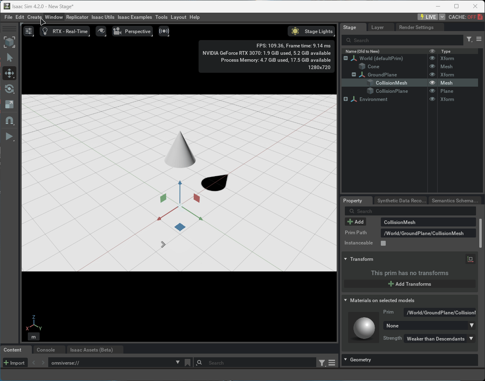
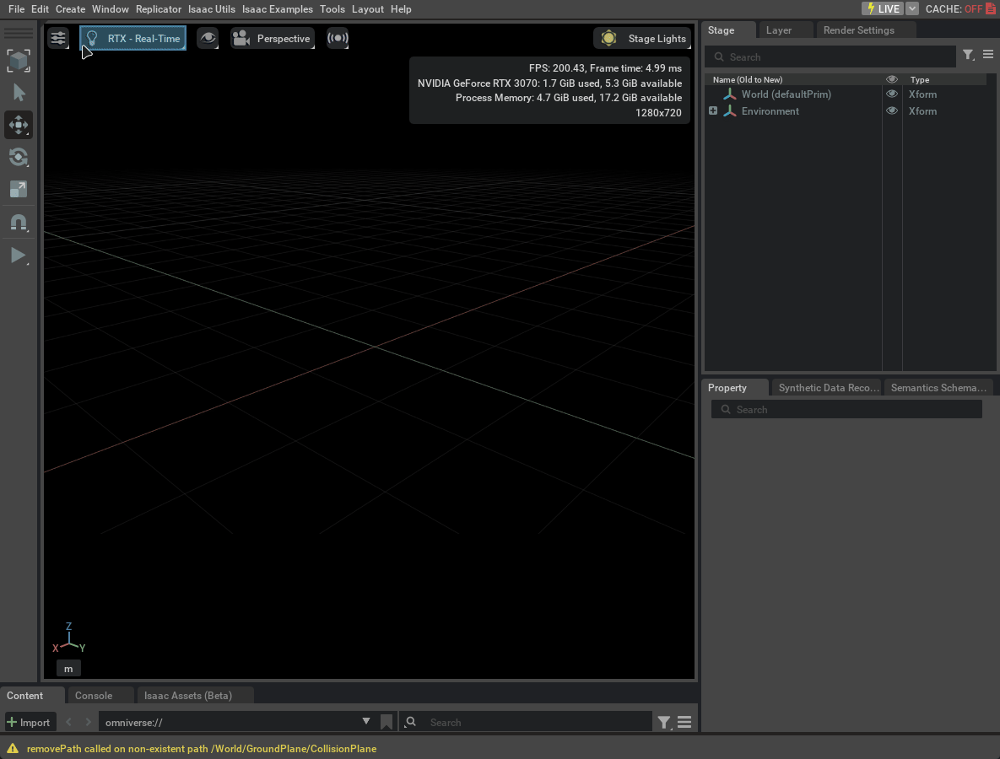
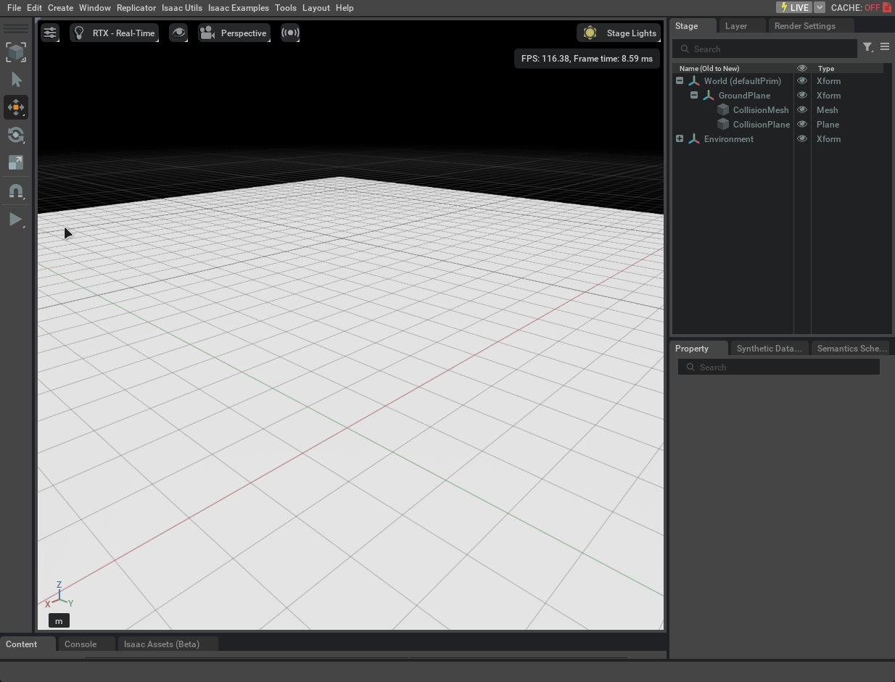
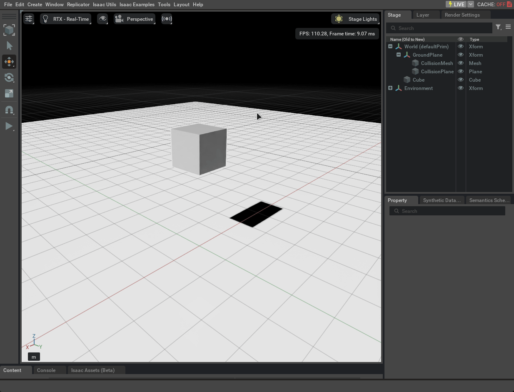
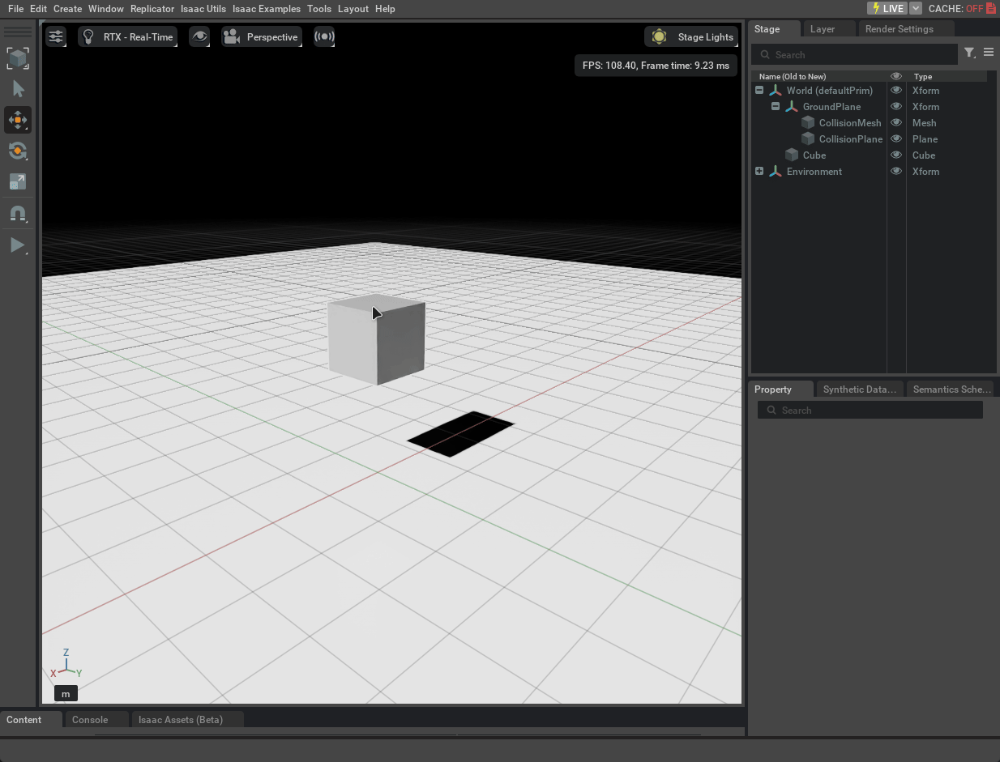
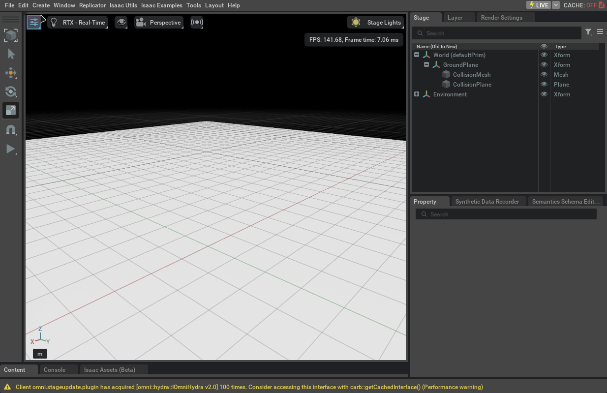
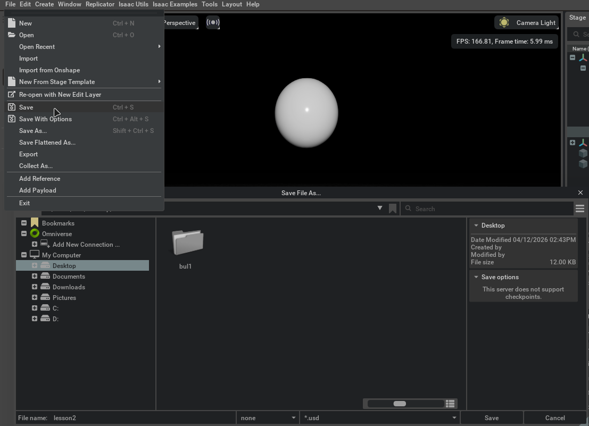

# Урок 2 — Объекты и физика

---

## Как устроена сцена в Isaac Sim

Любая сцена в Isaac Sim состоит из объектов — они называются **Prim** (от Primitive). Каждый объект в сцене это Prim: куб, сфера, свет, камера, робот.

Prims бывают двух типов:

**Визуальный** — объект есть в сцене, его видно, но физики у него нет. Он не падает, не сталкивается с другими. Как декорация.

**Физический** — объект подчиняется законам физики. Падает под гравитацией, сталкивается с другими объектами, реагирует на силы.

На этом уроке разберём, как создавать оба типа и в чём разница между ними на практике.

---

## Подготовка сцены

Начать с чистой сцены: `File → New`

После этого откроется пустая тёмная сцена — в Stage только `World` и `Environment`.

Для работающей физики нужны два обязательных элемента: **Ground Plane** и **Physics Scene**.

### Physics Scene

Physics Scene — контейнер, который включает физический движок. Без него гравитация и столкновения не работают.

Добавить: `Create → Physics → Physics Scene`

В Stage появится запись `PhysicsScene`. В Property у неё будут видны настройки: гравитация направлена по оси -Z с величиной 9.8 м/с² — как в реальном мире.

### Ground Plane

Ground Plane — бесконечная плоская поверхность с физикой. Объекты не проваливаются сквозь неё.

Добавить: `Create → Physics → Ground Plane`

После добавления в Stage появятся `GroundPlane`, `CollisionMesh` и `CollisionPlane` — компоненты физической поверхности.

### Освещение

Каждая новая сцена уже содержит `defaultLight`. Если его недостаточно, можно добавить направленный свет:

`Create → Lights → Distant Light`

После добавления сцена становится значительно светлее.

---

## Добавление объектов

Базовые формы находятся в: `Create → Shapes`

| Форма | Название |
|---|---|
| Куб | Cube |
| Сфера | Sphere |
| Конус | Cone |
| Цилиндр | Cylinder |
| Капсула | Capsule |

Добавим куб: `Create → Shapes → Cube`

Куб появится в центре сцены. Нажмём Play — он не упадёт. Это **визуальный** объект без физики, он просто стоит на месте.

---

## Физические свойства объекта

Чтобы объект стал физическим, нужно добавить ему **Rigid Body** и **Collision**.

**Rigid Body** — объект становится твёрдым телом, подчиняется гравитации и силам.

**Collision** — объект может сталкиваться с другими объектами. Без этого он проваливается сквозь пол.

### Как добавить физику

1. Выбрать объект кликом в Viewport или Stage — появится оранжевая подсветка
2. В панели Property нажать кнопку **+ Add**
3. Выбрать `Physics → Rigid Body with Colliders Preset`

Этот пресет добавляет сразу оба компонента одним кликом.

Теперь нажмём Play — объект упадёт на Ground Plane.

---

## Трансформация объектов

Каждый объект можно перемещать, вращать и масштабировать прямо в Viewport.

После выбора объекта появляются цветные стрелки — **Gizmo**. Клавиши переключают режим:

**W** — перемещение. Красная стрелка = X, зелёная = Y, синяя = Z. Тяни за стрелку, чтобы сдвинуть объект.

**E** — вращение. Появятся кольца по осям, тяни за них.

**R** — масштаб. Появятся квадраты по осям, тяни, чтобы растянуть.

Также можно вписать точные координаты в панели Property, раздел **Transform → Translate** — поля X, Y, Z в метрах.

---

## Физические материалы — трение и упругость

В Isaac Sim параметры трения и упругости задаются через **Physics Material** — отдельный материал с физическими свойствами.

### Создание Physics Material

`Create → Physics → Physics Material`

В появившемся окне выбрать **Rigid Body Material**. В Stage появится `PhysicsMaterial`, в Property будут видны его параметры:

**Static Friction** — трение покоя. Насколько сложно сдвинуть объект с места.

**Dynamic Friction** — трение движения. Насколько быстро объект замедляется при скольжении.

**Restitution** — упругость. От 0 (глухой удар, не отскакивает) до 1 (отскакивает на ту же высоту).

### Назначение материала на объект

1. Выбрать объект в Stage или Viewport
2. В Property найти раздел **Materials on selected models**
3. В выпадающем списке выбрать созданный `PhysicsMaterial`

---

## Несколько объектов и столкновения

Добавим несколько объектов и посмотрим, как они взаимодействуют. Создадим такую сцену:

1. Ground Plane и Physics Scene
2. Три куба с физикой, поставленные стопкой — каждый следующий поднять по Z
3. Сфера с физикой над стопкой

Каждому объекту добавить `Rigid Body with Colliders Preset`. Нажать Play.

---

## Сохранение сцены

`File → Save` или `Ctrl + S`

Сцены в Isaac Sim сохраняются в формате **USD** (Universal Scene Description) — открытый стандарт от Pixar и NVIDIA. Файл получает расширение `.usd`.

---

## Практические задания

### Задание 1 — Сцена с падающими объектами

Создай сцену с нуля: добавь Physics Scene и Ground Plane. Добавь куб и сферу через `Create → Shapes`. Дай каждому физику через `Rigid Body with Colliders Preset`. Подними сферу через поле Z в Transform. Запусти симуляцию.

Подсказка

Если объекты проваливаются сквозь Ground Plane — убедись, что Physics Scene добавлена. Без неё физика не работает, даже если у объекта есть Rigid Body.

Чтобы поднять сферу: выбери её → Property → Transform → Translate → увеличь Z до 3–5.

---

### Задание 2 — Эксперимент с упругостью

Создай сферу с физикой. Создай Physics Material через `Create → Physics → Physics Material`, выставь Restitution = 0.9. Назначь материал на сферу. Подними сферу на Z = 5 и запусти — посмотри, как она отскакивает. Затем поменяй Restitution на 0.0 и сравни результат.

Подсказка

Чтобы поменять параметры материала, не нужно пересоздавать его — выбери `PhysicsMaterial` в Stage, измени значение в Property и снова нажми Play.

Не забудь нажать Stop перед изменением параметров.

---

## Итоги урока

- Каждый объект в Isaac Sim — это Prim, визуальный или физический
- Для физики нужны: Physics Scene, Ground Plane и источник света
- Объекты добавляются через `Create → Shapes`
- Физика добавляется через `+ Add → Physics → Rigid Body with Colliders Preset`
- Перемещение — W, вращение — E, масштаб — R, или точные значения в Transform
- Трение и упругость задаются через Physics Material: `Create → Physics → Physics Material`
- Сцены сохраняются в формате USD через `File → Save`

---

*Следующий урок: роботы в Isaac Sim →*
