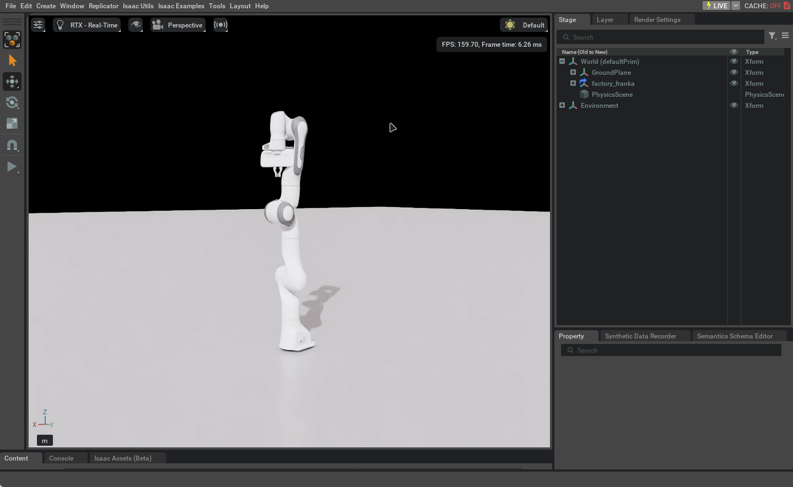
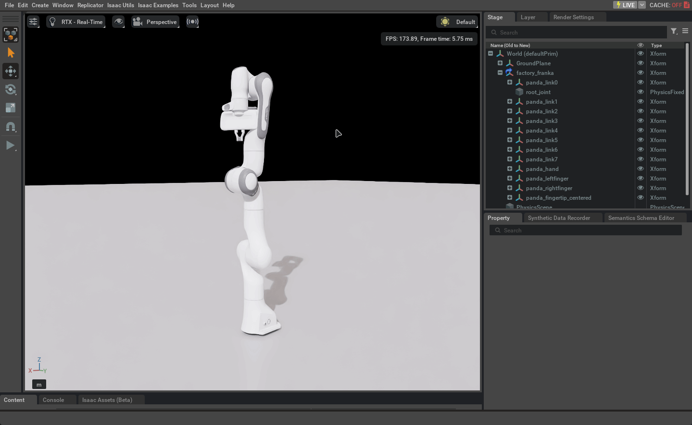
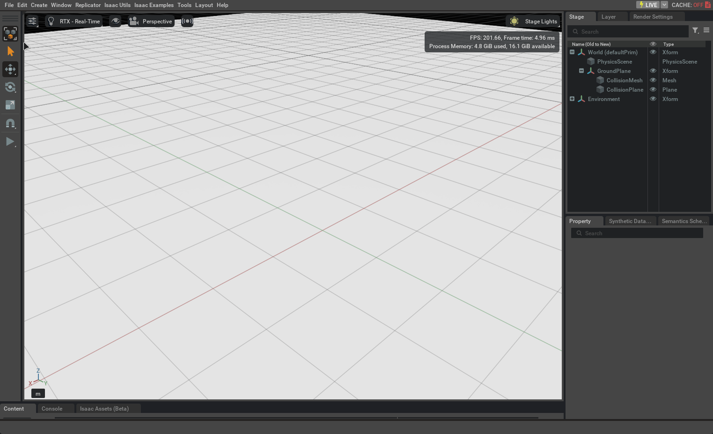
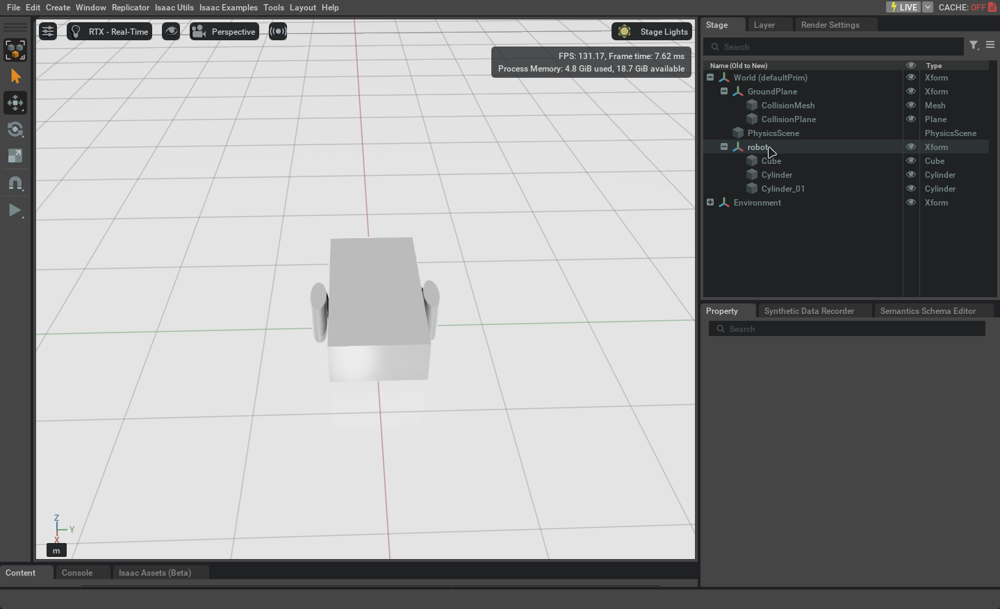
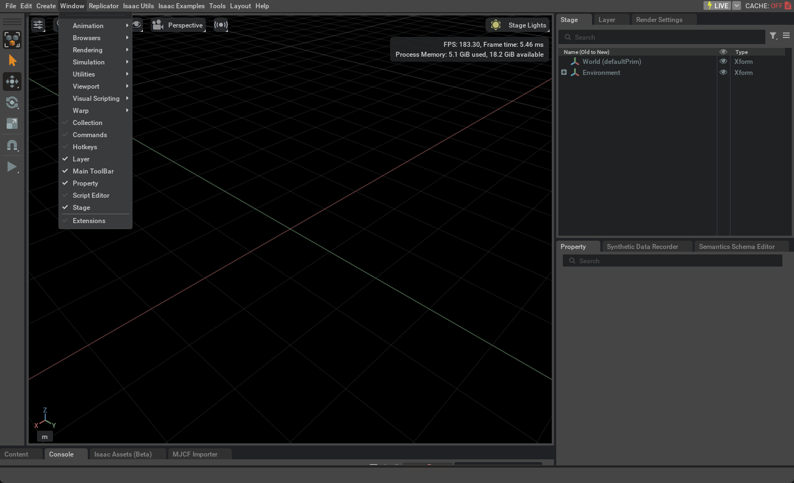

# Урок 3 — Роботы и первые шаги с кодом

---

# Часть 1 — Готовый робот: Franka Panda

## Знакомство с Franka

Isaac Sim поставляется с набором готовых роботов — их не нужно создавать с нуля. На этом уроке сначала посмотрим на профессиональный робот, чтобы понять, к чему стремимся. Потом соберём своего.

**Franka Emika Panda** — робот-манипулятор с 7 суставами. Один из самых популярных в академических исследованиях, используется в лабораториях по всему миру.


---

## Подготовка сцены и добавление робота

1. `File → New` — чистая сцена
2. `Create → Physics → Physics Scene`
3. `Create → Physics → Ground Plane`

Добавить робота: `Create → Isaac → Robots → Manipulators → Franka`

Или через нижнюю панель: вкладка **Isaac Assets (Beta)** → папка Robots → найти Franka → перетащить в Viewport.

<details>
<summary>▶ Добавление Franka в сцену</summary>


</details>

После добавления робот стоит в сцене статично. В Stage появится запись `panda` с вложенными элементами.

---

## Структура робота в Stage

Раскрой дерево `panda` в Stage кликом на треугольник рядом с названием.

<details>
<summary>▶ Дерево элементов робота в Stage</summary>



</details>

**panda** — корневой объект всего робота.

**panda_link0, panda_link1...** — звенья. Отдельные физические части корпуса. Каждое звено — твёрдое тело со своей массой и формой. Это те же Rigid Body объекты из урока 2.

**panda_joint1, panda_joint2...** — суставы. Соединяют звенья и задают, как они двигаются. У Franka 7 вращательных суставов.

**panda_hand, panda_finger** — захват с двумя пальцами.

Запомни эту структуру — звенья и суставы. Дальше в уроке мы соберём то же самое сами с нуля.

---

## Параметры суставов в Property

Кликни на сустав в Stage — например `panda_joint1`. В Property появятся его параметры.

<details>
<summary>▶ Параметры сустава в Property</summary>



</details>

**Lower limit / Upper limit** — диапазон поворота в радианах. Сустав не повернётся дальше этих значений — как локоть не сгибается в обратную сторону.

**Damping** — сопротивление движению. Высокое значение — сустав двигается медленно и плавно.

**Stiffness** — жёсткость. Высокое значение — сустав держит позицию и сопротивляется внешним силам.

Кликни поочерёдно на `panda_joint1` и `panda_joint7` — у суставов рядом с основанием и рядом с захватом параметры сильно отличаются.

---

## Запуск без контроллера

Нажми Play с роботом в сцене.

<details>
<summary>▶ Franka без контроллера под гравитацией</summary>


</details>

Робот обмякнет — суставы не удерживаются и звенья падают под гравитацией. Это нормально: робот добавлен, но команд на удержание позиции ему не поступает. Чтобы робот стоял и двигался — нужен контроллер. Именно этим займёмся в уроке 4.

---

# Часть 2 — Собираем своего робота

## Почему это важно

Теперь, когда видно, как устроена Franka — звенья, суставы, иерархия — соберём то же самое сами. Это даст понимание того, как работает любой робот в Isaac Sim изнутри.

Соберём двухколёсного робота: куб-корпус и два цилиндра-колеса, связанные суставами.

---

## Articulation Root — что это и зачем

**Articulation Root** — компонент, который говорит Isaac Sim: "это единый робот, считай его одной физической системой". Без него суставы не работают правильно.

Articulation Root добавляется один раз на корневой объект всей конструкции — на Xform, не на отдельные звенья.

---

## Шаг 1 — Корневой объект

`Create → Xform`

Xform — пустой контейнер без формы. Нужен как точка отсчёта для всего робота.

Переименуй в `Robot`: двойной клик на названии в Stage.

Выбери `Robot` в Stage → Property → **+ Add** → `Physics → Articulation Root`

<details>
<summary>▶ Создание корневого объекта с Articulation Root</summary>



</details>

---

## Шаг 2 — Корпус

`Create → Shapes → Cube`

В Stage перетащи `Cube` прямо внутрь `Robot` — drag & drop.

Property → Transform:
- **Scale** X=1.5, Y=0.8, Z=0.4
- **Translate** Z=0.3

**+ Add** → `Physics → Rigid Body with Colliders Preset`

<details>
<summary>▶ Добавление корпуса</summary>


</details>

---

## Шаг 3 — Колёса

`Create → Shapes → Cylinder` — первое колесо.

В Stage перетащи `Cylinder` прямо внутрь `Robot` — рядом с Cube, не внутрь него.

Иерархия должна выглядеть так:
```
Robot (Xform)
├── Cube
├── Cylinder_01
└── Cylinder_02
```

Property → Transform:
- **Scale** X=0.15, Y=0.4, Z=0.4
- **Orient** Z=90
- **Translate** X=0, Y=0.5, Z=0.2 — правая сторона

**+ Add** → `Rigid Body with Colliders Preset`

Создай второй цилиндр так же, Translate Y=-0.5 — левая сторона.

<details>
<summary>▶ Добавление колёс</summary>



</details>

---

## Шаг 4 — Суставы

Кликни `Cube` в Stage, зажми **Ctrl** и кликни `Cylinder_01`. Затем:

`Create → Physics → Joints → Revolute Joint`

Сустав появится в Stage. Кликни на него — в Property **обязательно** проверь и настрой:

- **Body 0** — нажми `+ Add Target...` и выбери `Cube`. Это родитель — корпус
- **Body 1** — должен уже указывать на `Cylinder_01`. Если пусто — добавь так же
- **Axis** → `Y`
- **Local Position 0** — где сустав крепится к корпусу
- **Local Position 1** — центр колеса

> Если Body 0 пустой — при запуске корпус улетит вверх. Это самая частая ошибка.

Повтори для левого колеса: выбери Cube + Cylinder_02, создай второй сустав, назначь Body 0 = Cube, Body 1 = Cylinder_02, Local Position 0 Y=-0.5.

---

## Шаг 5 — Проверка через Joint State Publisher

Прежде чем нажимать Play, удобно проверить суставы с помощью встроенного инструмента:

`Isaac Utils → Joint State Publisher`

Откроется небольшая панель со слайдерами. Каждый слайдер соответствует одному суставу робота. Перемещая слайдер, можно вручную покрутить колесо и убедиться, что сустав работает правильно и Body 0 / Body 1 назначены корректно — без запуска симуляции.

Нажми **Play** — робот упадёт на Ground Plane и будет стоять на колёсах.

<details>
<summary>▶ Сборка суставов и запуск</summary>


</details>

Если корпус улетает вверх — Body 0 не назначен в одном из суставов.  
Если всё разваливается — проверь иерархию: Cube и оба Cylinder должны быть прямо внутри `Robot`, не вложены друг в друга.

---

# Часть 3 — Script Editor: управляем кодом

## Как Python работает в Isaac Sim

Isaac Sim построен на платформе NVIDIA Omniverse. Всё что видишь в Stage — это объекты формата **USD (Universal Scene Description)**. Когда ты добавляешь куб через меню, Isaac Sim создаёт USD объект.

**Python API** — набор готовых функций для работы с этими объектами. Вместо клика мышью вызываешь функцию — она делает то же самое внутри. Например, `DynamicCuboid` делает то же, что `Create → Shapes → Cube` плюс `Rigid Body with Colliders Preset` из урока 2 — только одной строкой.

---

## Открываем Script Editor

`Window → Script Editor`

> Каждый запуск (Run) выполняет скрипт заново и создаёт новые объекты. Перед запуском делай `File → New`, чтобы начать с чистой сцены.

---

## Первый скрипт

```python
from omni.isaac.core.objects import GroundPlane

GroundPlane(prim_path="/World/GroundPlane", z_position=0)
```

`from X import Y` — подключить класс `Y` из библиотеки `X`. Без этой строки Python не знает, что такое `GroundPlane`.

`prim_path` — путь в Stage. Всегда начинается с `/World/`. Имя после слеша — как назовётся объект в Stage.

`z_position=0` — высота поверхности.

Запусти — в Stage появится `/World/GroundPlane`. То же самое, что `Create → Physics → Ground Plane`, только кодом.

<details>
<summary>▶ Запуск скрипта в Script Editor</summary>



</details>

---

## Объект с физикой

```python
import numpy as np
from omni.isaac.core.objects import DynamicCuboid

DynamicCuboid(
    prim_path="/World/Cube",
    position=np.array([0, 0, 2.0]),
    size=0.5,
    color=np.array([1.0, 0.0, 0.0])
)
```

`import numpy as np` — подключаем библиотеку для математики. Координаты в Isaac Sim передаются как массив из трёх чисел [X, Y, Z] — именно это делает `np.array`.

`DynamicCuboid` — куб с уже встроенными Rigid Body и Collision. `Dynamic` значит физический — аналог `Rigid Body with Colliders Preset` из урока 2.

`color=np.array([1.0, 0.0, 0.0])` — цвет в формате RGB, значения от 0 до 1. [1, 0, 0] = красный, [0, 1, 0] = зелёный, [0, 0, 1] = синий.

Запусти → нажми Play — красный куб падает на Ground Plane.

---

## Несколько объектов через цикл

```python
import numpy as np
from omni.isaac.core.objects import DynamicCuboid

for i in range(5):
    DynamicCuboid(
        prim_path=f"/World/Cube_{i}",
        position=np.array([i * 0.8, 0, 3.0]),
        size=0.4,
        color=np.array([i * 0.2, 0.5, 1.0])
    )
```

`for i in range(5)` — цикл. `i` принимает значения 0, 1, 2, 3, 4 по очереди.

`f"/World/Cube_{i}"` — f-строка вставляет значение `i` в текст. Получится `Cube_0`, `Cube_1`... Все prim_path должны быть уникальными, иначе объекты перезапишут друг друга.

`i * 0.8` — каждый следующий куб смещается на 0.8 м по X. Так они встают в ряд, а не друг в друге.

---

## Практические задания

### Задание 1 — Собери робота

Собери двухколёсного робота по инструкции из части 2. Убедись, что иерархия правильная — Cube и оба Cylinder прямо внутри Robot. Назначь Body 0 и Body 1 в обоих суставах. Проверь через Joint State Publisher, что слайдеры двигают колёса.

<details>
<summary>Подсказка</summary>

Самые частые ошибки:
- Body 0 не назначен — корпус улетает вверх при запуске
- Цилиндры вложены друг в друга вместо того, чтобы быть рядом внутри Robot
- Articulation Root добавлен на Cube вместо Robot (Xform)

Перечитай шаги 1–5 из части 2, если что-то не получается.

</details>

---

### Задание 2 — Воспроизведи сцену из урока 2 кодом

В уроке 2 ты создавал Ground Plane, куб и сферу вручную. Теперь сделай то же через Script Editor. `DynamicSphere` работает так же, как `DynamicCuboid` — только вместо `size` используй `radius`.

Попробуй написать скрипт самостоятельно, опираясь на примеры выше. Подсказку открывай только если застрял.

<details>
<summary>Подсказка</summary>

```python
import numpy as np
from omni.isaac.core.objects import GroundPlane, DynamicCuboid, DynamicSphere

GroundPlane(prim_path="/World/GroundPlane", z_position=0)

DynamicCuboid(
    prim_path="/World/Cube",
    position=np.array([0, 0, 2.0]),
    size=0.5,
    color=np.array([1.0, 0.0, 0.0])
)

DynamicSphere(
    prim_path="/World/Sphere",
    position=np.array([0.3, 0, 4.0]),
    radius=0.3,
    color=np.array([0.0, 0.8, 0.2])
)
```

</details>

---

## Итоги урока

**Franka Panda:**
- Манипулятор с 7 суставами: звенья (link) + суставы (joint) + захват
- Без контроллера обмякает под гравитацией — нужен скрипт управления (урок 4)

**Сборка робота:**
- Иерархия: Robot (Xform + Articulation Root) → Cube и Cylinder на одном уровне внутри
- При создании сустава: выбрать Cube, затем Cylinder через Ctrl+клик
- В Property сустава обязательно назначить Body 0 (корпус) и Body 1 (колесо)
- Joint State Publisher позволяет вручную проверить работу суставов: `Isaac Utils → Joint State Publisher`

**Код:**
- `from X import Y` — подключает нужный модуль
- `DynamicCuboid` / `DynamicSphere` — объекты с физикой, аналог Rigid Body из интерфейса
- `prim_path` — путь в Stage, всегда `/World/имя`
- `np.array([X, Y, Z])` — координаты через numpy
- `for i in range(N)` — создаёт много объектов за несколько строк

---

*Следующий урок: управляем роботом кодом →*
